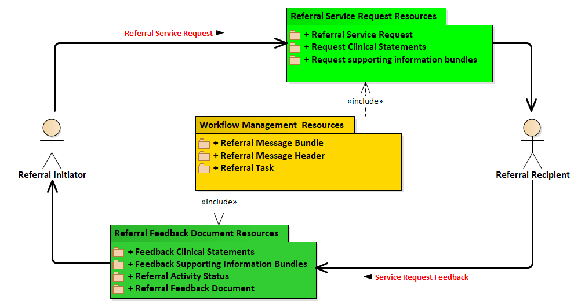

[Previous Page - Service Request and Referral Feedback Supporting Information Bundles](ServiceRequestandReferralFeedbackSupportingInformationBundles.html)

This specification defines two transactions types, a Referral Request Transaction and a Referral Feedback Transaction. The following diagram illustrates the two transaction flows covered in this specification. A referral service request flows from a referral imitator to a referral recipient. The referral service request transaction is comprised of the referral service request and its supporting information bundles and clinical statements. A service request feedback transaction flows from the referral recipient to the referral initiator. The service request feedback transaction is comprised of the referral feedback document containing the referral activity status, supporting information bundles and clinical statements.

<table><tr><td></td></tr></table>

The exchange of information between a referral service request initiator and a referral service request recipient is bi-directional. The sequence of exchanges supported in this guide are depicted in the following diagram:

<table><tr><td></td></tr></table>

[Next Page - Transport Options](TransportOptions.html)