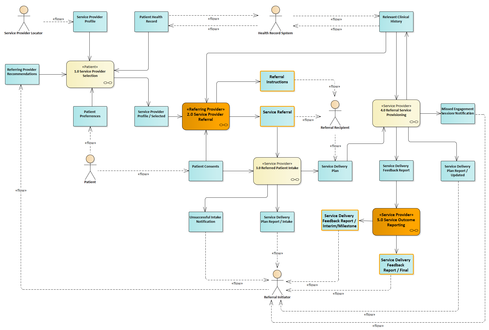

[Previous Page - Acknowledgements](Acknowledgements.html)

The scope of the BSeR IG is the placement of a service request referral by a referral initiator and the feedback of a service request outcome report by a referral recipient. The context of the request and feedback activities is depicted in the following activity diagram from the BSeR Domain Analysis Model (BSeR DAM).

<table><tr><td></td></tr></table>

The context of the BSeR IG is the placement of a referral by a clinical practitioner to a clinical or extra-clinical practitioner requesting preventive or therapeutic services for a patient with a health related condition requiring intervention. The requested service is typically a care regime or program specifically designed to address the patients condition. The six health related used case conditions within the scope of this specification are depicted in the following diagram:

<table><tr><td></td></tr></table>

See the section "Adaptation for Additional Referral Use Cases" for guidance in reusing or extending the use of the BSeR standard for use in additional referral use cases.

[Next Page - Resource Profiles](ResourceProfiles.html)