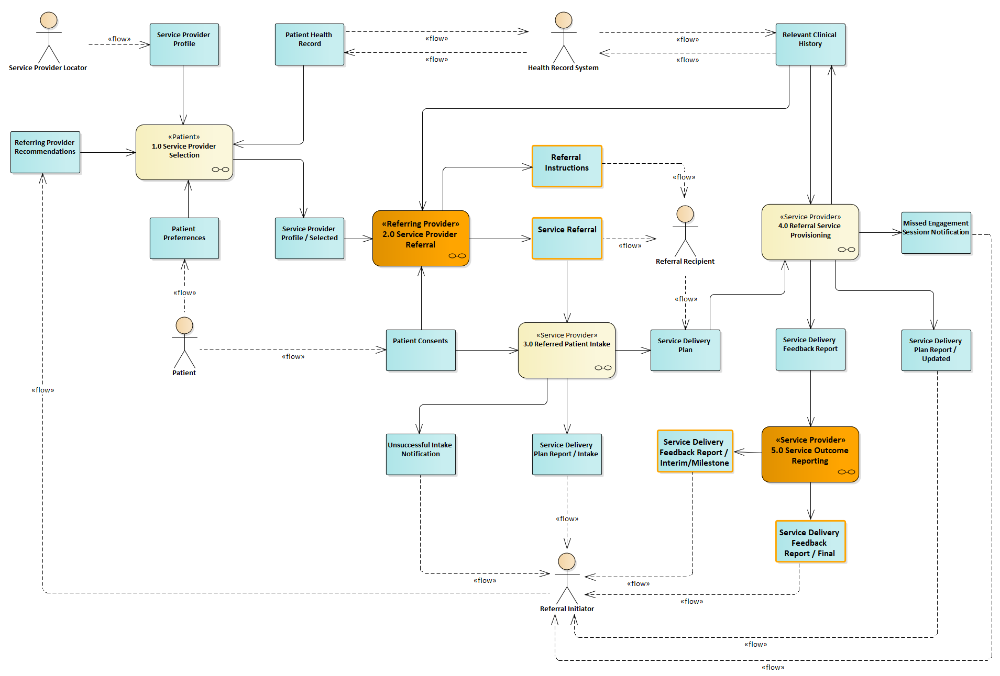

[Previous Page](toc.html)

The Bidirectional Services eReferral (BSeR) FHIR implementation guide provides guidance for using the HL7 Fast Healthcare Interoperability Resources (FHIR) standard as an exchange format for clinical and non-clinical service requests. It is a collection of profiled FHIR resources designed for use in information exchanges supporting the placement of a service request by a referral initiating provider and the reporting of service delivery outcomes by a referral recipient provider.

The scope of the BSeR IG is the placement of a service request referral by a referral initiator and the feedback of a service request outcome report by a referral recipient. The context of the request and feedback activities is depicted in the following activity diagram from the BSeR Domain Analysis Model (BSeR DAM). 

<table><tr><td></td></tr></table>

A key concept adopted in the design of the BSeR FHIR Profiles is the concept of parsimony. Under the HIPAA minimum necessary standard, covered entities must make reasonable efforts to ensure that access to protected health information (PHI) is limited, per the HIPAA Privacy Rule, to the minimum amount of information necessary to fulfill or satisfy the intended purpose of a particular disclosure, request, or use. 

A critical design requirement for BSeR is to limit the exchange of clinical information from initiating providers to recipient providers to only that data necessary to fulfill the service request. To fulfill this design requirement, the BSeR implementation guide separates the designation and profiling of FHIR resources related to the service request workflow from the FHIR resources required to convey the information content necessary for the fulfillment of the service request.

[Next Page](BSeR_Project_Team.html)